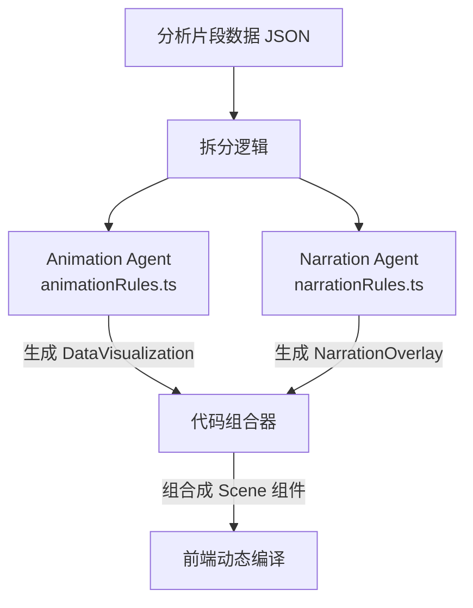

# 动画 Agent 修改与升级指南 (Animation Agent Guide)

MatchFlow 的一大特色是能够根据 AI 的分析结果，**动态生成 Remotion 视频代码** 并实时渲染。这个过程由专门的 "动画 Agent" (Remotion Agent) 负责。

本文档将指导你如何修改动画 Agent 的生成逻辑、添加新的动画图表类型，以及优化代码生成的成功率。

---

## 1. 动画 Agent 架构概览 (Updated)

为了降低复杂度并提高代码质量，动画 Agent 已被拆分为两个独立的子 Agent：

1.  **Animation Component Agent**: 专注于数据可视化（图表、球场图等）。
2.  **Narration Component Agent**: 专注于文字排版（标题、旁白字幕）。

最终生成的代码是一个包含这两个子组件的 `Scene` 组件。



### 核心文件说明

- **`src/services/ai.ts`**: 包含 `streamRemotionCode`，负责协调两个 Agent 并组合代码。
- **`src/services/remotion/animationRules.ts`**: **动画可视化规则**。定义了如何绘制图表。
- **`src/services/remotion/narrationRules.ts`**: **旁白排版规则**。定义了如何展示文字。
- **`src/services/remotionRules.ts`**: (旧/Legacy) 用于错误修复 (Fix Agent) 的兜底规则。

---

## 2. 实战演练：添加 "赔率趋势图" 动画

假设我们在数据分析阶段新增了 `odds-chart` 类型的动画数据。

### 步骤 1: 确保上游 Agent 输出正确的数据类型
(同原文档)

### 步骤 2: 修改 `animationRules.ts` (核心)

打开 `src/services/remotion/animationRules.ts`。这是动画可视化的 "宪法"。

你需要在这个文件中添加针对 `odds-chart` 的具体指导：

```typescript
// src/services/remotion/animationRules.ts

export const ANIMATION_RULES = `
...
**Components:**
   - **Bar Charts:** ...
   
   // [新增]
   - **Odds Chart:** Display three cards for Home/Draw/Away with animated numbers.
...
`;
```

**注意：** 不要在 `animationRules.ts` 中处理标题或旁白，只关注数据可视化。

### 步骤 3: 强化可用组件库 (可选)
(同原文档)

---

## 3. 优化代码生成成功率

由于拆分了 Agent，现在的 Prompt 更短、更专注，生成质量通常更高。

1.  **Narration Agent**: 只需要关注文字排版，不再会被复杂的图表逻辑干扰。
2.  **Animation Agent**: 只需要关注图表，不需要处理文字布局。

如果发现某个部分（例如图表）经常出错，请只修改对应的 `animationRules.ts`。

---

## 4. 错误自愈机制 (Auto-Fix)

目前的 Fix Agent 仍然使用旧的 `remotionRules.ts` 进行全局修复。如果生成的组合代码有错误，Fix Agent 可能会将其重写为一个单一的组件。这是预期的兜底行为。
