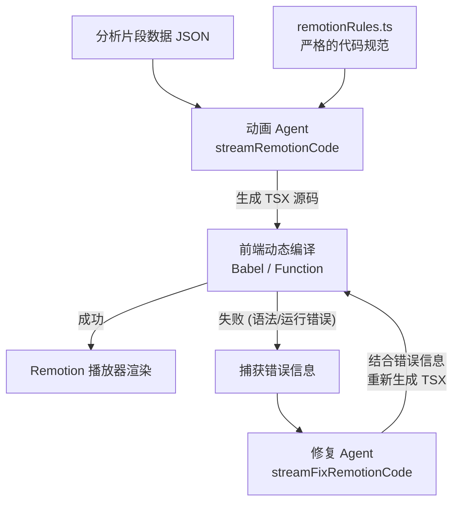

# 动画 Agent 修改与升级指南 (Animation Agent Guide)

MatchFlow 的一大特色是能够根据 AI 的分析结果，**动态生成 Remotion 视频代码** 并实时渲染。这个过程由专门的 "动画 Agent" (Remotion Agent) 负责。

本文档将指导你如何修改动画 Agent 的生成逻辑、添加新的动画图表类型，以及优化代码生成的成功率。

---

## 1. 动画 Agent 架构概览

动画 Agent 的核心任务是将结构化的 JSON 数据（包含标题、旁白、数值等）转换为可执行的 React/Remotion TSX 代码。



### 核心文件说明

- **`src/services/ai.ts`**: 包含 `streamRemotionCode` (首次生成) 和 `streamFixRemotionCode` (错误修复) 的调用逻辑。
- **`src/services/remotionRules.ts`**: **最核心的文件**。它包含了给 AI 的 System Prompt，严格规定了 AI 只能使用哪些库、如何编写动画逻辑、如何使用 Tailwind CSS 等。

---

## 2. 实战演练：添加 "赔率趋势图" 动画

假设我们在数据分析阶段新增了 `odds-chart` 类型的动画数据。现在我们需要教动画 Agent 如何把它画出来。

### 步骤 1: 确保上游 Agent 输出正确的数据类型

在 `src/services/ai.ts` 的 `generateAnalysisPlan` 中，确保规划 Agent 能够输出 `animationType: 'odds-chart'`。

同时，确保分析 Agent 生成的 `<animation>` JSON 中包含所需的数据：
```json
{
  "type": "odds-chart",
  "title": "赔率走势",
  "data": { "homeOdds": 1.5, "awayOdds": 4.0, "drawOdds": 3.8 }
}
```

### 步骤 2: 修改 `remotionRules.ts` (核心)

打开 `src/services/remotionRules.ts`。这是 AI 编写代码的 "宪法"。

你需要在这个长文本字符串中，添加针对 `odds-chart` 的具体指导：

```typescript
// src/services/remotionRules.ts

export const REMOTION_RULES = `
You are an expert React and Remotion developer.
... (原有规则) ...

### SUPPORTED ANIMATION TYPES & TEMPLATES:

1. **stats**: Use bar charts...
2. **tactical**: Use a football pitch layout...
3. **comparison**: Use side-by-side layouts...

// [新增] 4. 赔率图表规则
4. **odds-chart**: 
   - Layout: Display three prominent cards or circles for Home, Draw, and Away odds.
   - Animation: Make the numbers count up from 0 using \`spring\` or \`interpolate\`.
   - Styling: Use emerald for Home (if favorite), zinc for Draw, red for Away.
   - Data Mapping: Read \`data.homeOdds\`, \`data.awayOdds\`, \`data.drawOdds\` from the props.

... (原有规则) ...
`;
```

### 步骤 3: 强化可用组件库 (可选)

如果你的新动画需要特殊的 UI 组件（例如雷达图、特殊的 SVG 图标），你必须在 `remotionRules.ts` 中明确告诉 AI **它可以 import 哪些东西**。

MatchFlow 的动态编译环境是受限的。AI 不能随意 `import { LineChart } from 'recharts'`，除非你在前端的动态编译沙箱中注入了 `recharts`。

**当前允许的 Imports (在 rules 中定义):**
```typescript
import React from 'react';
import { AbsoluteFill, interpolate, spring, useCurrentFrame, useVideoConfig, Sequence } from 'remotion';
import { Activity, TrendingUp, ... } from 'lucide-react'; // 只能用 lucide-react 的图标
```

如果你想让 AI 画复杂的图表，最好的方式是**教它用基础的 `div` 和 Tailwind CSS 组合**，或者教它画简单的 SVG。

---

## 3. 优化代码生成成功率 (Prompt Engineering)

动画 Agent 经常会写出报错的代码（例如使用了未定义的变量、Tailwind 类名拼写错误）。以下是优化 `remotionRules.ts` 的最佳实践：

1.  **提供防御性代码示例**:
    在 Rules 中告诉 AI："始终检查 `props.data` 是否存在，如果缺失则提供默认值。"
    ```typescript
    const homeValue = props.data?.homeOdds || 0;
    ```

2.  **严格限制动画 API**:
    Remotion 的动画依赖 `useCurrentFrame()`。明确告诉 AI 如何使用 `interpolate`：
    ```typescript
    // 在 Rules 中给出标准写法
    const frame = useCurrentFrame();
    const opacity = interpolate(frame, [0, 15], [0, 1], { extrapolateRight: 'clamp' });
    ```

3.  **禁用外部 CSS**:
    强调 **"绝对不允许使用 style 标签或外部 CSS 文件，只能使用 Tailwind 类名"**。

---

## 4. 错误自愈机制 (Auto-Fix)

MatchFlow 内置了错误自愈机制。当生成的代码在浏览器中执行失败时，应用会捕获错误堆栈，并调用 `streamFixRemotionCode`。

如果你发现 AI 总是犯同一种错误（例如总是忘记闭合标签，或者总是 import 不存在的库），你可以：

1.  **修改 Fix Agent 的 Prompt**:
    在 `src/services/ai.ts` 的 `streamFixRemotionCode` 中，加入更严厉的警告。
    ```typescript
    const prompt = `
      ${REMOTION_RULES}
      
      CRITICAL: You previously failed because you imported a library that is NOT ALLOWED.
      ONLY use 'react', 'remotion', and 'lucide-react'.
      
      ERRORS: ${errors.join('\n')}
      WRONG CODE: ${wrongCode}
      ...
    `;
    ```

2.  **在 Rules 中增加 "Anti-Patterns" (反模式) 章节**:
    明确列出 AI 经常犯的错误并禁止它们。

通过不断完善 `remotionRules.ts`，你可以让动画 Agent 生成越来越复杂、越来越稳定的视频组件。
